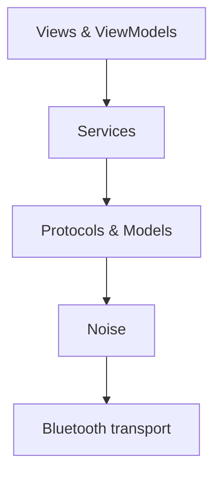

# Agent Onboarding for Mchat

Use this file to quickly orient yourself around the repository and follow best practices.

## Repository layout

### Core app – `bitchat/`
* `BitchatApp.swift` – application entry point.
* `Views/` – SwiftUI screens for chat, settings, and onboarding.
* `ViewModels/` – state and UI logic paired with views.
* `Models/` – domain objects such as `Message`, `Thread`, and identity structs.
* `Identity/` – three-layer identity system (ephemeral IDs, Noise static keys, social profiles).
* `Noise/` – XX handshake and ChaCha20-Poly1305 encryption stack.
* `Protocols/` – message framing, compression, and binary flag handling.
* `Services/`
  * `BluetoothMeshService.swift` – peer discovery, message relaying, TTL handling.
  * `ChatService.swift` – higher-level send/receive flows.
* `Nostr/` – optional NIP‑17 direct message integration.
* `Utils/` – helpers like serialization and crypto wrappers.

### Shared modules – `Mchat/`
* `Auth/` – AWS Amplify + Cognito setup and authentication helpers.
* `Membership/` – campus credential validation, caching, and topic management.
* `Net/` – REST API client for profile fetch and credential issuance.

### Tests – `MchatTests/`
* `Protocol/` – frame encoding/decoding tests.
* `Noise/` – handshake and cipher suite tests.
* `Integration/` – cross-layer flows.
* `EndToEnd/` – full app scenarios.
* `Mocks/` and `TestUtilities/` – reusable test helpers.

### Other directories
* `bitchatShareExtension/` – share extension target for iOS.
* `project.yml` – XcodeGen configuration; run `make xcodeproj` to regenerate.
* `Justfile` – development scripts for macOS builds.

Other useful documents:
* `AI_CONTEXT.md` – deep architectural overview and design goals.
* `WHITEPAPER.md` – protocol details and security rationale.
* `BRING_THE_NOISE.md` – Noise protocol implementation notes.
* `README.md` – project summary and build instructions.

## Architecture layers



## Finding features

* **Follow a screen** – start in `bitchat/Views`, then open the matching file in `ViewModels`.
* **Modify Bluetooth behavior** – see `Services/BluetoothMeshService.swift` and related helpers in `Utils/`.
* **Change message encoding** – edit `Protocols/` and mirror changes in tests under `MchatTests/Protocol/`.
* **Tweak crypto** – `Noise/` holds handshake logic; tests live in `MchatTests/Noise/`.
* **Authentication or membership** – consult `Mchat/Auth` and `Mchat/Membership`.

## Working in this repo
- Use `rg` for code search; avoid `grep -R` or `ls -R` in large directories.
- Run the test suite before committing changes:
  ```bash
  swift test
  ```
- For macOS builds the `Justfile` offers recipes like `just run` and `just clean`.
- Follow standard Swift style; no custom linter is configured.

## Suggested starting points
1. Read the documents above to understand the mesh protocol and security model.
2. Explore `MchatTests/` for examples of protocol flows and Noise handshakes.
3. When adding features, respect the layering shown above.
